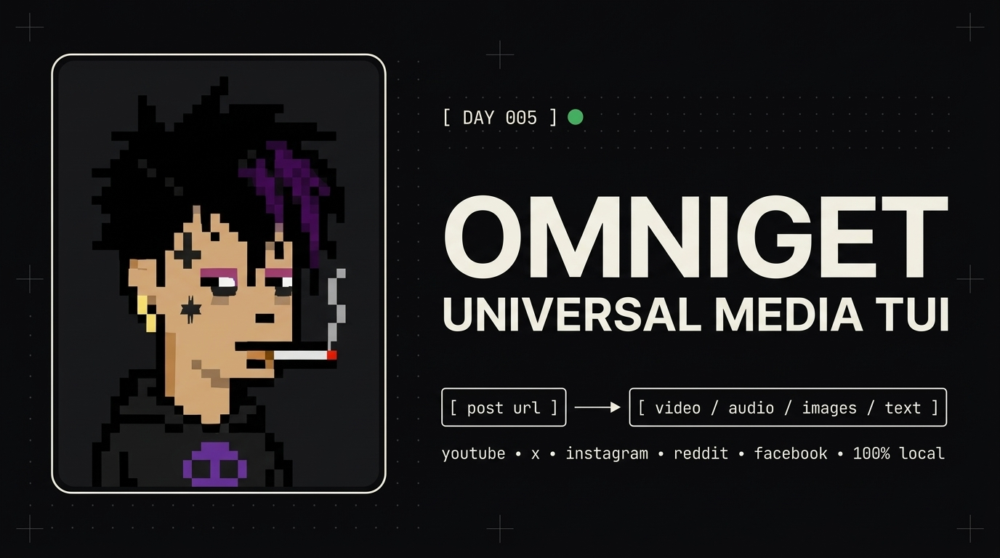
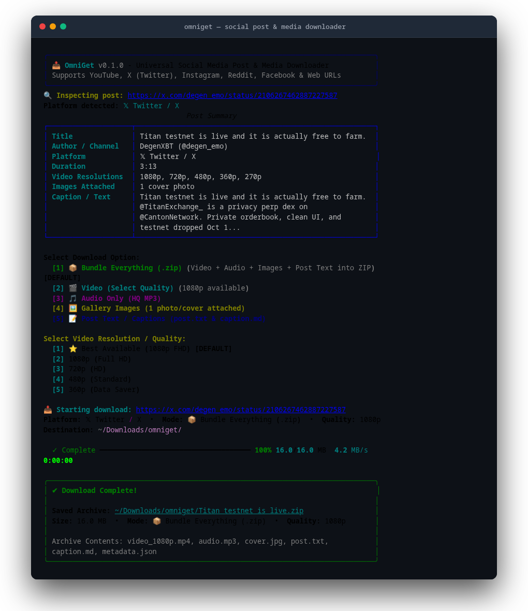

# OmniGet 📥

> **Universal Social Media Post, Video, Audio, Image & Text Downloader TUI**  
> *Peak interactive terminal interface powered by `yt-dlp` and `ffmpeg`.*

<div align="center">
  
</div>

---

## 📸 Screenshot & Visual Walkthrough

### Interactive Terminal TUI & CLI
*Inspects metadata, prompts for video resolution / quality, displays live byte progress with real MB/s transfer speed, and bundles everything into clean ZIP archives:*

<div align="center">
  
</div>

---

## ⚡ The Problem

Downloading content from social media platforms (YouTube, X/Twitter, Instagram, Reddit, Facebook) is filled with annoying friction:
- Ad-heavy, sketchy third-party web downloaders filled with popups and malware.
- Online tools strip captions, fail on multi-image carousels, or compress videos to 360p.
- Reddit video audio is stored in separate streams (`v.redd.it`), requiring manual ffmpeg merging.
- Messy file clutter: long, broken social media titles full of emojis and URLs that ruin folder organization.
- No unified terminal tool that can grab everything at once: high-res video, audio track, carousel photos, and original post text in one place.

**OmniGet** solves this with a **fast, peak-interactive terminal TUI**: paste any post link, inspect all available assets, choose desired quality, and download video (up to 4K), audio (MP3), images, or formatted post text with 1 click.

---

## ✨ Features

- 💻 **Peak Interactive Terminal TUI**:
  - **Clipboard Auto-Detect**: Automatically detects social links from your system clipboard on launch.
  - **Live Download Telemetry**: Real-time progress bar (0% -> 100%), transfer speed (MB/s), ETA, and file size.
  - **Video Quality Picker**: Interactive resolution selector (Best, 1080p Full HD, 720p HD, 480p, 360p).
- 🗂️ **Platform-Specific Subfolders (Zero Clutter)**:
  - Separate dedicated directories for each platform: `~/Downloads/omniget/x/`, `omniget/youtube/`, `omniget/reddit/`, `omniget/instagram/`, `omniget/facebook/`.
  - Downloads never get mixed up.
- 🔢 **Clean Sequential Naming**:
  - Folders and ZIP archives use clean, predictable sequential names: `tweet 1.zip`, `tweet 2.zip`, `youtube 1.zip`, `reddit 1.zip`.
  - No more 200-character broken titles cluttering your file manager.
- 📦 **Bundle Everything (.zip)**:
  - 1-command packages high-res video, extracted audio MP3, uncompressed gallery photos, caption (`.md` & `.txt`), and `metadata.json` into a single organized ZIP archive.
- 🌐 **Platform Auto-Detect & Multi-Tier Fallbacks**:
  - 🔴 **YouTube**: Videos, Shorts, 4K/1080p, and high-fidelity MP3 audio.
  - 𝕏 **X (Twitter)**: MP4 videos, GIFs, multi-image tweet galleries (FxTwitter fallback), and tweet text.
  - 📸 **Instagram**: Reels, video posts, multi-photo carousel albums, and captions.
  - 🤖 **Reddit**: Videos with automatically merged audio tracks, galleries, and post text.
  - 📘 **Facebook**: Public videos, Reels, photos, and post content.
- 🖼️ **Uncompressed Original Photos**:
  - Upgrades Twitter images to `name=orig`, YouTube thumbnails to `maxresdefault.jpg`, and Reddit images to uncompressed full-res.
- 🕒 **Download Library & History**:
  - Built-in SQLite history tracking with `omniget --history`.
- 🔒 **100% Local & Free**:
  - Powered by native `yt-dlp` and `ffmpeg`. Zero external cloud relays, zero API fees.

---

## 🚀 Quick Install

### One-Command Setup:
```bash
git clone https://github.com/aotlover9-base-eth/omniget.git
cd omniget
./install.sh
```

Or install via `uv`:
```bash
uv tool install . --force
```

---

## 💻 Usage

### 1. Interactive Terminal TUI
Simply run:
```bash
omniget
```
OmniGet will auto-detect links from your clipboard or prompt you to paste a URL. It inspects metadata, lets you choose formats and video resolutions, and renders real-time download telemetry.

### 2. Fast CLI Mode (Scriptable)
```bash
# Download video with specific quality (1080p, 720p, 480p, 360p, best)
omniget "https://www.youtube.com/watch?v=..." --video -q 1080p

# Download audio only as HQ MP3
omniget "https://www.youtube.com/watch?v=..." --audio

# Download gallery photos / full uncompressed images
omniget "https://x.com/user/status/..." --images

# Save post caption as Markdown (.md)
omniget "https://x.com/user/status/..." --text

# Bundle Everything into a ZIP archive (Video + Audio + Images + Post Text)
omniget "https://x.com/user/status/..." --bundle

# Inspect post metadata without downloading
omniget "https://youtube.com/shorts/..." --inspect

# View download library
omniget --history
```

---

## 🧪 Quick Test Links (All Platforms)

Copy and run these commands to test each supported platform immediately:

### 🔴 YouTube (Video, Audio & Thumbnail)
```bash
# Interactive mode (prompts for Bundle, Video Quality, Audio, or Thumbnail):
omniget "https://www.youtube.com/watch?v=dQw4w9WgXcQ"

# Direct 720p MP4 download:
omniget "https://www.youtube.com/watch?v=dQw4w9WgXcQ" --video -q 720p

# YouTube Shorts bundle:
omniget "https://youtube.com/shorts/5xH_h38aH60" --bundle
```

### 𝕏 Twitter / X (Video, Audio, Photos & Text)
```bash
# Video post with caption:
omniget "https://x.com/degen_emo/status/2106267462887227587" --bundle

# Photo post (extracts uncompressed originals):
omniget "https://x.com/OpenAI/status/1834280548170281146" --images
```

### 🤖 Reddit (v.redd.it Video + Merged Audio & Galleries)
```bash
# Reddit video with merged audio:
omniget "https://www.reddit.com/r/MadeMeSmile/comments/1fq8g3k/little_girl_hears_for_the_first_time/" --video

# Reddit post caption & text:
omniget "https://www.reddit.com/r/technology/comments/1fq8g3k/test/" --text
```

### 📸 Instagram (Reels & Carousels)
```bash
# Public Reel:
omniget "https://www.instagram.com/reel/C8q8q0_OIW7/" --video
```

### 📘 Facebook (Public Video & Reels)
```bash
# Public video inspection & download:
omniget "https://www.facebook.com/watch/?v=10153231379946729" --inspect
```

---

## 🏛️ Architecture

```
User Terminal (omniget)
┌───────────────────────────────────────────────────────────┐
│               Interactive Terminal TUI (Rich)             │
│   Clipboard Detection • Quality Selector • Live Progress  │
└─────────────────────────────┬─────────────────────────────┘
                              │
                    ┌─────────▼─────────┐
                    │ Core Engine       │
                    │ Platform Routing  │
                    │ Sequential Naming │
                    └─────────┬─────────┘
                              │
          ┌───────────────────┼───────────────────┐
          │                   │                   │
┌─────────▼─────────┐ ┌───────▼─────────┐ ┌───────▼─────────┐
│ Video & Audio     │ │ Image Galleries │ │ Post Captions   │
│ yt-dlp + ffmpeg   │ │ Direct extract  │ │ Text & Metadata │
│ 1080p/4K / MP3    │ │ High-Res Photos │ │ Markdown / JSON │
└───────────────────┘ └─────────────────┘ └─────────────────┘
          │                   │                   │
          └───────────────────┼───────────────────┘
                              ▼
        Saved to ~/Downloads/omniget/<platform>/
        (e.g., omniget/x/tweet 1.zip, omniget/youtube/youtube 1.zip)
```

---

## 🧪 Running Tests

```bash
pytest -v
```

---

## 📄 License

MIT License. Built for the 100 Days, 100 Problems, 100 Solutions challenge.
