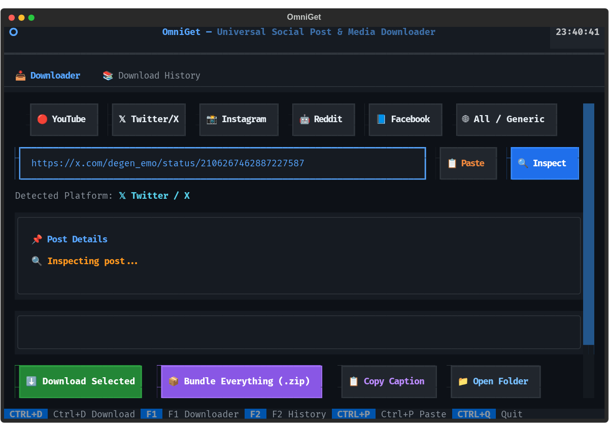

# OmniGet 📥

> **Universal Social Media Post, Video, Audio, Image & Text Downloader TUI**  
> *Peak interactive terminal interface powered by `yt-dlp` and `ffmpeg`.*

<div align="center">
  
</div>

---

## 📸 Screenshots & Visual Walkthrough

### 1. Interactive Terminal Console (Fast TUI / CLI)
*Inspects metadata, prompts for video quality, shows live byte progress with real MB/s, and bundles everything into clean ZIP archives:*

<div align="center">
  
</div>

### 2. Graphical Textual TUI (`omniget --gui`)
*Full mouse support, 1-click clipboard paste, format selector chips, and download history table:*

<div align="center">
  
</div>

---

## ⚡ The Problem

Downloading content from social media platforms (YouTube, X/Twitter, Instagram, Reddit, Facebook) is filled with annoying friction:
- Ad-heavy, sketchy third-party web downloaders filled with popups and malware.
- Online tools strip captions, fail on multi-image carousels, or compress videos to 360p.
- Reddit video audio is stored in separate streams (`v.redd.it`), requiring manual ffmpeg merging.
- No unified terminal interface that can grab everything at once: the high-res video, audio track, carousel photos, and original post text in one place.

**OmniGet** solves this with a **fast, peak-interactive terminal console**: paste any post link, inspect all available assets, and download video (up to 4K), audio (MP3), images, or formatted post text with 1 mouse click.

---

## ✨ Features

- 🖱️ **Peak Interactive Terminal UI (Textual)**:
  - **Full Mouse Support**: Click platform tabs, buttons, checkboxes, destination pickers, and view live progress bars right in your terminal.
  - **1-Click Clipboard Paste**: Tap `[📋 Paste]` to grab any link directly from your system clipboard.
- 🌐 **Platform Chooser & Auto-Detect**:
  - 🔴 **YouTube**: Videos, Shorts, 4K/1080p, and high-fidelity MP3/M4A audio.
  - 𝕏 **X (Twitter)**: MP4 videos, GIFs, multi-image tweet galleries, and tweet text.
  - 📸 **Instagram**: Reels, video posts, multi-photo carousel albums, and captions.
  - 🤖 **Reddit**: Videos with automatically merged audio tracks, galleries, and post text.
  - 📘 **Facebook**: Public videos, Reels, photos, and post content.
  - 🌐 **Auto-Detect**: Paste any supported link and OmniGet automatically detects the platform and configures format options.
- 📦 **Multi-Asset Ingestion**:
  - 🎬 **Video**: Best quality, 1080p, or 720p with audio automatically multiplexed.
  - 🎵 **Audio**: Instant extraction and conversion to MP3/M4A.
  - 🖼️ **Images**: Download all carousel images, thumbnails, or post photo galleries.
  - 📝 **Post Text / Captions**: 1-click copy caption to clipboard or save as formatted `.md` file.
  - 📦 **Full Post Bundle**: Saves the media + metadata + text together into `~/Downloads/omniget/<title>/`.
- 📊 **Live Download Telemetry**:
  - Real-time progress bar (0% -> 100%), download speed (MB/s), ETA, and file size.
- 🕒 **Download History & Library**:
  - View recent downloads directly inside the TUI with 1-click open in default file manager.
- 🔒 **100% Local & Free**:
  - Powered by native `yt-dlp` and `ffmpeg`. Zero external cloud relays, zero API fees.

---

## 🚀 Quick Install

### One-Command Setup:
```bash
git clone https://github.com/aotlover9-base-eth/omniget.git
cd omniget
./install.sh
```

Or install via `uv`:
```bash
uv tool install . --force
```

---

## 💻 Usage

### 1. Interactive Terminal Console (Mouse & Keyboard)
Simply run:
```bash
omniget
```

### 2. Fast CLI Mode (Scriptable)
```bash
# Download video with specific quality (1080p, 720p, 480p, 360p, best)
omniget "https://www.youtube.com/watch?v=..." --video -q 1080p

# Download audio only as HQ MP3
omniget "https://www.youtube.com/watch?v=..." --audio

# Download gallery photos / full uncompressed images
omniget "https://x.com/user/status/..." --images

# Save post caption as Markdown (.md)
omniget "https://x.com/user/status/..." --text

# Bundle Everything into a ZIP archive (Video + Audio + Images + Post Text)
omniget "https://x.com/user/status/..." --bundle

# Inspect post metadata without downloading
omniget "https://youtube.com/shorts/..." --inspect

# View download library
omniget --history
```

---

## 🧪 Quick Test Links (All Platforms)

Copy and run these commands to test each supported platform immediately:

### 🔴 YouTube (Video, Audio & Thumbnail)
```bash
# Interactive mode (prompts for Bundle, Video Quality, Audio, or Thumbnail):
omniget "https://www.youtube.com/watch?v=dQw4w9WgXcQ"

# Direct 720p MP4 download:
omniget "https://www.youtube.com/watch?v=dQw4w9WgXcQ" --video -q 720p

# YouTube Shorts bundle:
omniget "https://youtube.com/shorts/5xH_h38aH60" --bundle
```

### 𝕏 Twitter / X (Video, Audio, Photos & Text)
```bash
# Video post with caption:
omniget "https://x.com/degen_emo/status/2106267462887227587" --bundle

# Photo post (extracts uncompressed originals):
omniget "https://x.com/OpenAI/status/1834280548170281146" --images
```

### 🤖 Reddit (v.redd.it Video + Merged Audio & Galleries)
```bash
# Reddit video with merged audio:
omniget "https://www.reddit.com/r/MadeMeSmile/comments/1fq8g3k/little_girl_hears_for_the_first_time/" --video

# Reddit post caption & text:
omniget "https://www.reddit.com/r/technology/comments/1fq8g3k/test/" --text
```

### 📸 Instagram (Reels & Carousels)
```bash
# Public Reel:
omniget "https://www.instagram.com/reel/C8q8q0_OIW7/" --video
```

### 📘 Facebook (Public Video & Reels)
```bash
# Public video inspection & download:
omniget "https://www.facebook.com/watch/?v=10153231379946729" --inspect
```

---

## 🏛️ Architecture

```
User Terminal (omniget)
┌───────────────────────────────────────────────────────────┐
│              Textual TUI (Obsidian Dark Theme)             │
│  Platform Selector • URL Input • Format Pickers • Status  │
└─────────────────────────────┬─────────────────────────────┘
                              │
                    ┌─────────▼─────────┐
                    │ Core Engine       │
                    │ Platform Detect   │
                    │ Metadata Ingest   │
                    └─────────┬─────────┘
                              │
          ┌───────────────────┼───────────────────┐
          │                   │                   │
┌─────────▼─────────┐ ┌───────▼─────────┐ ┌───────▼─────────┐
│ Video & Audio     │ │ Image Galleries │ │ Post Captions   │
│ yt-dlp + ffmpeg   │ │ Direct extract  │ │ Text & Metadata │
│ 1080p/4K / MP3    │ │ High-Res Photos │ │ Markdown / Text │
└───────────────────┘ └─────────────────┘ └─────────────────┘
          │                   │                   │
          └───────────────────┼───────────────────┘
                              ▼
           Saved to ~/Downloads/omniget/<title>/
```

---

## 🧪 Running Tests

```bash
pytest -v
```

---

## 📄 License

MIT License. Built for the 100 Days, 100 Problems, 100 Solutions challenge.
